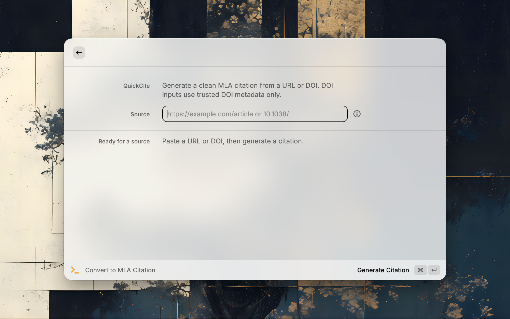
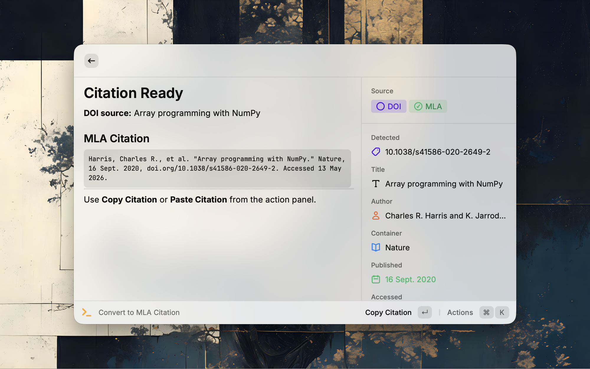

# QuickCite

QuickCite generates MLA citations from URLs and DOIs directly in Raycast.

## Features

- Convert article URLs into MLA-style citations.
- Convert DOI values using Crossref and doi.org metadata.
- Extract web page metadata from Open Graph, meta tags, JSON-LD, and page titles.
- Copy the generated citation to the clipboard.

## Usage

Open **Convert to MLA Citation**, paste a URL or DOI, and run **Generate Citation**.

For DOI inputs, QuickCite uses DOI metadata only. If no DOI metadata is found, it shows an error instead of generating a citation from incomplete data.
